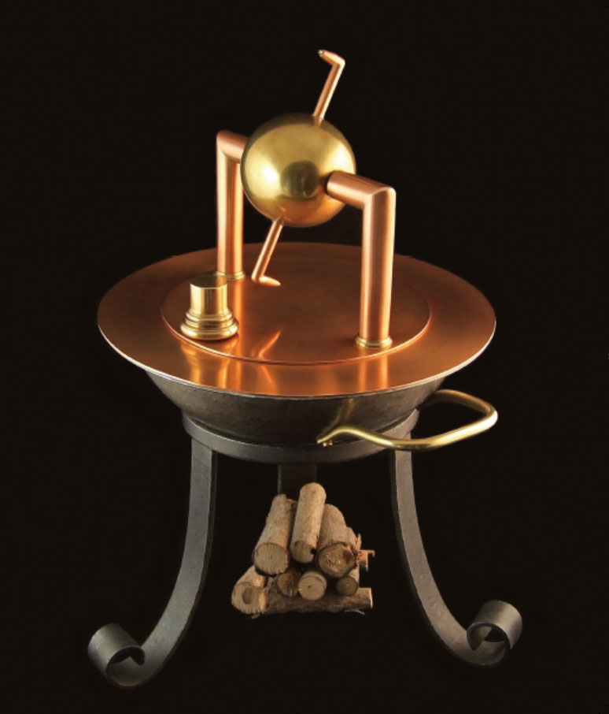
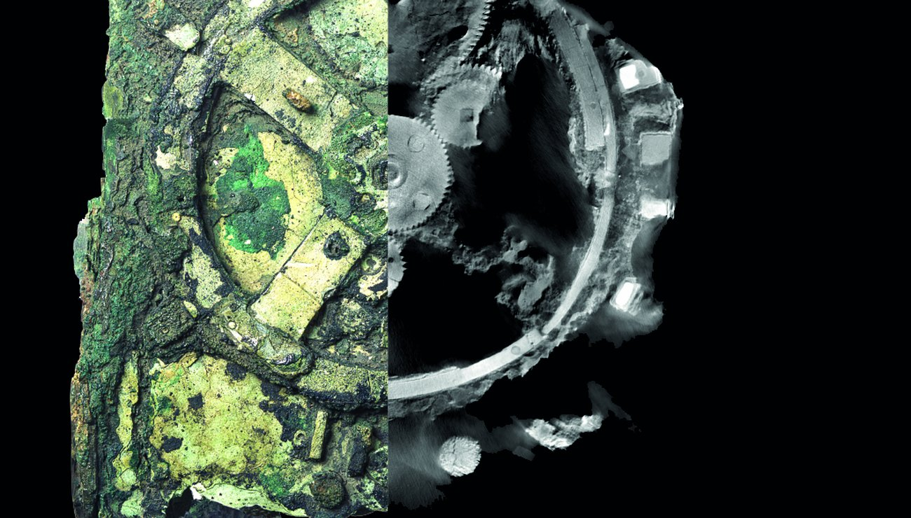
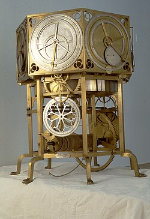

# 🌌 L'Odyssée de l'Intelligence Artificielle : Des Origines Anthropologiques aux Horizons Contemporains <!-- omit in toc -->
_Romuald COURTOIS, 29/08/2025_ 
 
 
 
 

# 🎯 Objectif <!-- omit in toc -->

Retracer l’évolution de l’intelligence artificielle, depuis les fondements anthropologiques et cognitifs de l’Homme jusqu’aux perspectives futures, afin de comprendre comment la quête d’optimisation et de simplification a façonné les outils, les machines et, aujourd’hui, l’IA.

# 🔑 Idée directrice <!-- omit in toc -->

L’histoire de l’IA est l’histoire de l’_« éternel fainéant ambitieux »_ : l’Homme, en cherchant à économiser son énergie, a sans cesse inventé de nouvelles solutions techniques, ouvrant ainsi des possibilités inédites. Cette logique d’extension et de délégation culmine dans les technologies d’intelligence artificielle contemporaines.

# 🚀 Valeur ajoutée <!-- omit in toc -->

- Approche chronologique et conceptuelle, reliant innovations techniques, contexte culturel et impact sociétal.
- Mise en lumière du fil rouge anthropologique : la paresse comme moteur d’innovation.
- Ouverture sur les défis futurs : éthique, gouvernance, durabilité.
 
 

### 💡 Thèse principale : L'intelligence artificielle n'est pas une innovation du XXe siècle, mais l'aboutissement de 40 000 ans de recherche humaine pour créer des extensions de nos capacités cognitives et physiques. <!-- omit in toc -->
 
 
 
 

# Table des matières <!-- omit in toc -->
- [PARTIE I : Fondations anthropologiques et mythologiques](#partie-i--fondations-anthropologiques-et-mythologiques)
  - [1. L'éternel fainéant ambitieux : économie d'énergie cognitive et paresse créative](#1-léternel-fainéant-ambitieux--économie-dénergie-cognitive-et-paresse-créative)
  - [2. Préhistoire \& Antiquité : du mythe aux premières machines logiques](#2-préhistoire--antiquité--du-mythe-aux-premières-machines-logiques)
- [PARTIE II : De la mécanisation à la formalisation (800-1750)](#partie-ii--de-la-mécanisation-à-la-formalisation-800-1750)
  - [3. Automates médiévaux et machines logiques](#3-automates-médiévaux-et-machines-logiques)
  - [4. Renaissance mécanique et corpus philosophique](#4-renaissance-mécanique-et-corpus-philosophique)
- [PARTIE III : Rationalisation mécanique et calcul (1750-1945)](#partie-iii--rationalisation-mécanique-et-calcul-1750-1945)
  - [5. Automates sophistiqués, révolution industrielle et naissance du calcul mécanique](#5-automates-sophistiqués-révolution-industrielle-et-naissance-du-calcul-mécanique)
  - [6. Tensions fondatrices : crises, algèbre, incomplétude et formalisations modernes](#6-tensions-fondatrices--crises-algèbre-incomplétude-et-formalisations-modernes)
- [PARTIE IV : L'âge d'or théorique \& avènement des machines (1945-1970)](#partie-iv--lâge-dor-théorique--avènement-des-machines-1945-1970)
  - [7. Mathématiciens et ingénieurs de la computation](#7-mathématiciens-et-ingénieurs-de-la-computation)
  - [8. Naissance officielle de l’IA : critères, conférence et premiers programmes](#8-naissance-officielle-de-lia--critères-conférence-et-premiers-programmes)
- [PARTIE V : Cycles d'enthousiasme, hivers et paradigmes émergents (1970-2000)](#partie-v--cycles-denthousiasme-hivers-et-paradigmes-émergents-1970-2000)
  - [9. Approches symboliques et connexionnistes : premiers antagonismes](#9-approches-symboliques-et-connexionnistes--premiers-antagonismes)
  - [10. Premier hiver de l’IA : réalités et désillusions (1974–1980)](#10-premier-hiver-de-lia--réalités-et-désillusions-19741980)
  - [11. Renaissance des systèmes experts et Mardi noir de l’IA (1980–1987)](#11-renaissance-des-systèmes-experts-et-mardi-noir-de-lia-19801987)
  - [12. Deuxième hiver et transition statistique (1987–1997)](#12-deuxième-hiver-et-transition-statistique-19871997)
- [PARTIE VI : Convergence et synthèse contemporaine (2000-2025)](#partie-vi--convergence-et-synthèse-contemporaine-2000-2025)
  - [11. L’ère Internet et renaissance du machine learning](#11-lère-internet-et-renaissance-du-machine-learning)
  - [12. Révolution deep learning et émergence neuro-symbolique](#12-révolution-deep-learning-et-émergence-neuro-symbolique)
  - [13. Ère Transformers et explosion générative](#13-ère-transformers-et-explosion-générative)
  - [14. Course concurrentielle et piège de Moloch](#14-course-concurrentielle-et-piège-de-moloch)
- [PARTIE VII : Vers une nouvelle intelligence - La révolution Fristonienne](#partie-vii--vers-une-nouvelle-intelligence---la-révolution-fristonienne)
  - [15. Karl Friston et le principe de l’énergie libre](#15-karl-friston-et-le-principe-de-lénergie-libre)
  - [16. Facteurs humains et IA centrée sur l’humain](#16-facteurs-humains-et-ia-centrée-sur-lhumain)
    - [16.1 Ergonomie cognitive et interfaces adaptatives](#161-ergonomie-cognitive-et-interfaces-adaptatives)
    - [16.2 Lecture des pensées par mouvements oculaires](#162-lecture-des-pensées-par-mouvements-oculaires)
    - [16.3 Cognition énactive et systèmes bio-inspirés](#163-cognition-énactive-et-systèmes-bio-inspirés)
- [PARTIE VIII : Leçons des échecs et succès technologiques](#partie-viii--leçons-des-échecs-et-succès-technologiques)
  - [17. Échecs emblématiques et analyses critiques](#17-échecs-emblématiques-et-analyses-critiques)
  - [18. Succès instructifs et bonnes pratiques](#18-succès-instructifs-et-bonnes-pratiques)
  - [19. Enjeux clés et perspectives](#19-enjeux-clés-et-perspectives)
- [PARTIE IX : Futurs possibles et imaginaires critiques](#partie-ix--futurs-possibles-et-imaginaires-critiques)
  - [20. Vers l’AGI bio-inspirée : Active Inference et conscience artificielle](#20-vers-lagi-bio-inspirée--active-inference-et-conscience-artificielle)
  - [21. Black Mirror et prospective critique : dystopies et coopérations](#21-black-mirror-et-prospective-critique--dystopies-et-coopérations)
  - [22. L’odyssée inachevée : vers une intelligence augmentée et collaborative](#22-lodyssée-inachevée--vers-une-intelligence-augmentée-et-collaborative)
- [PARTIE X : Évolution de l’éthique de l’IA](#partie-x--évolution-de-léthique-de-lia)
  - [23. Évolution de l’éthique de l’IA](#23-évolution-de-léthique-de-lia)
- [Conclusion](#conclusion)
- [📚 8. Bibliographie](#-8-bibliographie)

 
 
 

# PARTIE I : Fondations anthropologiques et mythologiques
## 1. L'éternel fainéant ambitieux : économie d'énergie cognitive et paresse créative

> *L'Éternel Fainéant Ambitieux*
> De l’économie d’énergie à l’extension des possibles

**Le principe d'économie d'énergie : une constante anthropologique**

L'histoire de l'intelligence artificielle trouve ses racines les plus profondes dans une caractéristique fondamentale de l'espèce humaine : sa tendance naturelle à l'économie d'énergie cognitive. Cette propension, loin d'être un défaut moral, constitue un mécanisme adaptatif essentiel qui a guidé l'évolution technologique de l'humanité depuis ses origines ([Kahneman, 2011](#kahneman2011)).Le cerveau humain, bien qu'il ne représente que 2% du poids corporel, consomme près de 20% de notre énergie métabolique totale ([Raichle & Gusnard, 2002](#raichle2022)). 

Des études récentes en neurosciences confirment cette tendance. Cheval et al. (2018) ont démontré que l’évitement de l’inactivité physique nécessite un investissement accru des ressources cérébrales. “Nos cerveaux sont câblés pour préférer rester sur le canapé”, une caractéristique héritée de nos ancêtres chasseurs-cueilleurs pour qui l’économie d’énergie était vitale pour la survie ([Cheval et al., 2018](#cheval2018)).

**Préhistoire lointaine : Émergence de l’intelligence (−7 Ma → −300 000 ans)**

   

La “paresse créative” s’exprime dès l’invention des premiers outils lithiques. Les choppers oldowayens (−2,7 Ma) et bifaces acheuléens (−1,6 Ma) sont autant d’illustrations de l’externalisation technologique d’une fonction biologique : prolonger la main pour économiser l’effort physique direct ([Harmand et al., 2015](#harmand2015)). L’évolution vers des outils Levallois plus sophistiqués témoigne d’une anticipation et d’une planification accrues, toujours guidées par la recherche d’efficacité maximale avec un minimum d’effort ([Leroi-Gourhan, 1964](#leroi1964)).

**La domestication du feu : première révolution énergétique**

Maîtrisé dès −400 000 ans, le feu représente la première source d’énergie externe dominée par l’homme ([Gowlett, 2016](#gowlett2016)). Au-delà de la cuisson des aliments, il permet de réduire l’énergie dépensée pour la digestion, libérant des ressources métaboliques pour le développement cérébral ([Wrangham, 2009](#wrangham2009)). Le feu, en prédigérant les aliments, illustre parfaitement la logique de la paresse créative : utiliser l’énergie externe plutôt que celle contenue dans les nutriments.

**Préhistoire récente : Explosion symbolique (−300 000 → −10 000 ans)**

   

L’émergence du langage résulte également d’une optimisation énergétique. Selon la théorie de Huntley et Hayden, les locuteurs adaptent leur articulation pour être compris avec un minimum d’effort, un principe d’“hypo-articulation” comparable aux interfaces homme-machine modernes ([Lindblom, 1990](#lindblom1990)). Parallèlement, l’art pariétal (peinture rupestre) et les premières représentations symboliques fonctionnent comme des supports externes de mémoire, libérant la capacité cognitive pour d’autres tâches ([Lewis-Williams, 2002](#lewis2002)).

**Néolithique : Révolution technologique (−10 000 → −3 000 ans)**

L’agriculture et l’élevage instaurent une production d’énergie excédentaire, marquant un tournant dans l’histoire humaine ([Diamond, 1997](#diamond1997)). L’invention de la roue, la traction animale et l’irrigation illustrent la logique d’amplification énergétique : maximiser les rendements tout en minimisant l’effort humain direct. L’écriture, née vers −3 000 ans pour la comptabilité des ressources, constitue la forme la plus aboutie d’externalisation symbolique des tâches cognitives répétitives ([Diamond, 1997](#diamond1997)).

**L’ambition par la paresse : extensions des possibles**

La “paresse créative” n’est ni vice ni faiblesse, mais moteur fondamental de l’innovation. De l’outil lithique à la cuisson du feu, de l’écriture à l’IA contemporaine, l’humanité poursuit une quête constante : libérer ses capacités créatives en confiant les tâches répétitives à des systèmes externes. L’intelligence artificielle apparaît ainsi comme l’aboutissement logique d’une odyssée technologique vieille de plusieurs millions d’années. Cette continuité anthropologique éclaire les enjeux actuels non comme des ruptures radicales, mais comme les nouveaux chapitres d’un même récit, guidé par le principe de l’économie d’énergie cognitive.

## 2. Préhistoire & Antiquité : du mythe aux premières machines logiques

> *"Des dieux forgèrent les premiers automates, l'homme rêva de les égaler"*
> Du mythe à la machine : genèse des intelligences artificielles
> 
> Citation adaptée d'Homère, Iliade, XVIII, 376-377, inspirée des créations d'Héphaïstos.

**Imaginaires techniques : les premiers "robots" conceptuels**

Bien avant que l'humanité ne possède les moyens techniques de créer de véritables automates, l'imaginaire collectif avait déjà conçu des êtres artificiels dotés d'intelligence. Cette anticipation mythologique révèle une constante anthropologique : le désir de créer des auxiliaires automatisés pour économiser l'effort humain.

**Talos**, le géant de bronze de la mythologie grecque, constitue l'archétype du robot protecteur. Créé par Héphaïstos selon Les Argonautiques d'Apollonius de Rhodes (IIIe siècle av. J.-C.), ce colosse automatisé fait "trois fois par jour le tour de la Crète" pour repousser les envahisseurs ([Apollonius de Rhodes. (s.d.). Argonautiques (IV, 1638‑1648)](#apollonius)). Sa construction révèle une sophistication conceptuelle remarquable : alimenté par l'ichor (sang divin) circulant dans une veine unique, il possède un point de défaillance unique à la cheville, préfigurant les vulnérabilités des systèmes informatiques modernes.

Le mythe de Pygmalion et Galatée explore une autre dimension : la création d'une intelligence artificielle par amour plutôt que par utilité. Selon Ovide ([Ovide, s.d., X, 243‑297](#ovide)), le sculpteur chypriote façonne une femme d'ivoire si parfaite qu'elle obtient la vie grâce à Aphrodite. Ce récit anticipe les questionnements contemporains sur l'anthropomorphisation des IA et l'attachement émotionnel aux créatures artificielles, comme l'illustrent aujourd'hui les relations avec les assistants conversationnels.

La tradition hébraïque offre avec le Golem une vision plus pragmatique de la création artificielle. Cette créature d'argile, animée par l'inscription du mot emet ("vérité") sur son front, sert de protecteur de la communauté juive. Sa désactivation par effacement de la première lettre (aleph), transformant emet en met ("mort"), préfigure les protocoles d'arrêt des systèmes automatisés ([Idel, 1990](#idel1990)).

**Réalisations techniques : Héron d'Alexandrie et la mécanique programmable**

   

L'Égypte hellénistique du Ier siècle apr. J.-C. voit naître les premiers automates véritablement fonctionnels sous l'impulsion d'Héron d'Alexandrie. Ses traités *Pneumatica* et *Automata* décrivent des mécanismes sophistiqués utilisant "l'air, la vapeur ou l'eau" comme force motrice, destinés à "susciter l'étonnement et l'émerveillement" ([Héron d’Alexandrie, s.d.](#heron)).

Les portes automatiques du temple d'Héron illustrent parfaitement cette ingénierie anticipatrice. Activées par la chaleur d'un feu allumé sur l'autel, elles s'ouvrent grâce à un système pneumatique sophistiqué : l'air chaud dilate l'eau dans une cuve souterraine, créant une pression qui actionne les mécanismes d'ouverture. Ce système révèle une logique de programmation primitive : une séquence prédéterminée d'actions déclenchée par un stimulus externe.

Plus révolutionnaires encore, les trépieds automobiles d'Héron constituent les premiers véhicules programmables de l'histoire. Ces chariots suivent un parcours prédéfini grâce à un "système de cordes enroulées" autour des essieux, préfigurant les algorithmes de navigation contemporains. Leur fonctionnement anticipe de deux millénaires les principes de la robotique mobile autonome.

L'*éolipyle* (sphère éolienne) d'Héron, premier moteur à vapeur fonctionnel, démontre que l'Antiquité possédait les bases théoriques de la révolution industrielle. Cette "machine à vapeur ancestrale" restera pourtant sans application pratique, illustrant le décalage entre innovation technique et adoption sociale.

**Machine d'Anticythère : premier ordinateur analogique**

   

Découverte en 1901 dans une épave au large de l'île grecque d'Anticythère, cette machine de bronze datant du IIe siècle av. J.-C. constitue le premier ordinateur analogique de l'histoire. Ses 37 engrenages en bronze permettaient de "calculer avec précision la position du soleil, de la lune et des planètes" ([Freeth et al., 2021](#freeth2021)).

Les recherches récentes de l'University College London ont révélé la sophistication exceptionnelle de ce dispositif. Capable de prédire les éclipses, les phases lunaires et même les dates des Jeux olympiques, il intègre des cycles astronomiques complexes avec une précision qui "remet en cause toutes nos idées préconçues sur les capacités technologiques des anciens Grecs" ([Freeth et al., 2021](#freeth2021)).

La machine d'Anticythère révèle l'existence d'une tradition technologique avancée dans l'Antiquité grecque. Son niveau de sophistication ne sera retrouvé qu'avec les horloges astronomiques médiévales, près de 1500 ans plus tard. Elle témoigne d'une capacité de calcul automatisé et de prédiction qui préfigure directement les fonctions des ordinateurs modernes.

**Aristote et les fondements de la logique formelle**

Parallèlement à ces innovations techniques, Aristote (384-322 av. J.-C.) pose les bases théoriques de la logique formelle dans ses *Premiers Analytiques*. Sa théorie du syllogisme constitue le premier système de *"raisonnement déductif"* formalisé, établissant des "règles d'inférence formelles dont le caractère contraignant relève de l'évidence" ([Aristote, s.d., I, 4](#aristote)).

Le syllogisme aristotélicien, avec ses trois propositions (deux prémisses et une conclusion) articulant trois termes, préfigure les structures algorithmiques modernes. Sa formalisation par l'usage de variables (A, B, C) constitue la première abstraction logique permettant de manipuler des contenus conceptuels indépendamment de leur sens spécifique.

Cette logique formelle établit les fondements de ce qui deviendra, deux millénaires plus tard, l'*informatique théorique*. Les "règles d'inférence" d'Aristote anticipent les opérations booléennes et les systèmes de preuve automatisée qui constitueront l'ossature de l'intelligence artificielle symbolique.

**Transmission et héritage**

L'Antiquité grecque et hellénistique lègue ainsi à la postérité trois éléments fondamentaux pour le développement futur de l'IA :
- des imaginaires techniques (mythes d'automates intelligents), 
- des réalisations mécaniques (automates d'Héron, machine d'Anticythère),
- des formalisations logiques (syllogistique aristotélicienne).

Cette convergence entre imagination, technique et logique constitue la matrice originelle de l'intelligence artificielle. Elle révèle que le projet d'automatisation de l'intelligence n'est pas une rupture moderne, mais l'aboutissement d'une quête anthropologique millénaire : économiser l'énergie cognitive humaine en externalisant le raisonnement dans des systèmes automatisés.

La synthèse antique de ces trois dimensions - mythologique, technique et logique - établit les fondations conceptuelles sur lesquelles s'édifiera, près de deux millénaires plus tard, la révolution de l'intelligence artificielle contemporaine.

# PARTIE II : De la mécanisation à la formalisation (800-1750)

## 3. Automates médiévaux et machines logiques

> *"Dans l’eau et la vapeur, jaillit l’esprit des automates."*
> 
> Citation librement inspirée des inventions hydrauliques d’al-Jazari (1206).

**Al-Jazari et la révolution hydraulique programmable**

Au début du XIIIᵉ siècle, Abū al-ʿIz̄ Ibn Ismāʿīl al-Jazarī (1136–1206) codifie pour la première fois les procédés mécaniques dans son *Kitāb fī maʿrifat al-ḥiyal al-handasiyya* (1206). Il y décrit plus de cinquante dispositifs, parmi lesquels l’*horloge-éléphant*, structure monumentale de sept mètres animée par des pistons et un vilebrequin couplés à un réservoir hydraulique. Ce mécanisme, orné d’éléments symboliques (éléphant, dragon, phénix), illustre une programmation primitive par séquences temporelles : chaque heure, des automates serviteurs distribuent rafraîchissements selon un cycle prédéfini, préfigurant le concept de routine algorithmique ([al‑Jazarī, 1206](#aljazari1206)).

Outre les horloges, al-Jazari invente des serviteurs mécaniques délivrant boissons ou serviettes, activés par des pressions d’eau successives. Ces humanoïdes fluidiques incarnent l’idée d’une séquence d’actions automatisées, où chaque étape déclenche la suivante sans intervention humaine, anticipant les systèmes de contrôle séquentiel modernes ([Hill, 1993](#hill1993)). Ses innovations - machines à pomper, robinets automatiques, vilebrequins – influencent directement l’ingénierie hydraulique et mécanique jusqu’à la révolution industrielle.

**Llull et la première machine logique**

Vers 1305, Ramon Llull (1232–1316) publie l’Ars Magna, où il présente une “machine de papier” composée de disques concentriques inscrits de symboles théologiques et philosophiques. En faisant tourner ces disques, l’utilisateur génère toutes les combinaisons conceptuelles possibles pour résoudre des questions de foi ou de science. Llull postule l’existence d’un alphabet universel des idées, dont l’ordonnancement mécanique permettrait de prouver ou réfuter tout énoncé ([Llull, vers 1305](#llull1305)).

Cette formalisation algorithmique du raisonnement constitue le premier jalon de l’IA symbolique : la pensée comme combinaison de symboles. Llull anticipe la création de langages de programmation et de systèmes de preuve automatisée. Son influence s’étend jusqu’à Leibniz, qui reconnaît dans l’*Ars Magna* les prémices de son *calculus ratiocinator* et de son projet de *mathesis universalis*.

**Astrarium : computing mécanique et modélisation du cosmos**

   

Au XIVᵉ siècle, l’Europe savante érige les horloges astronomiques en modèles de computing mécanique. L’*astrarium* de Giovanni Dondi (1330–1388), construit entre 1365 et 1381 à Padoue, est une horloge planétaire qui indique heure, date, positions du Soleil, de la Lune et des cinq planètes visibles (Mercure, Vénus, Mars, Jupiter, Saturne) via un réseau de 200 engrenages articulés ([Dondi, 1365–1381](#dondi1365)).

Chaque cadran et chaque engrenage traduisent un modèle mathématique du ciel en opérations mécaniques automatiques, simulant le mouvement des astres selon le système ptoléméen (Géocentrisme). Comme le note Lynn White Jr., ces instruments sont “moins des chronomètres que des expositions mobiles du cosmos”. Ils témoignent de la conviction médiévale que la machine peut refléter la structure de l’univers, préparant l’idée de simulation numérique contemporaine ([White, 1962, p. 122](#white1862)).

## 4. Renaissance mécanique et corpus philosophique

> *“Le mécanisme n’est pas l’ennemi de l’âme, mais son meilleur serviteur.”*
> 
> Inspiré de René Descartes, Discours de la méthode (1637).

**Scolastique : vers l’algorithme du débat intellectuel**

Entre le IXᵉ et le XVᵉ siècle, la scolastique codifie le raisonnement dialectique. Les quaestiones disputatae (questions disputées) et les summae (synthèses encyclopédiques) structurent l’argumentation en étapes formelles : question initiale, objections, réponses, résolution finale. Chaque étape suit des règles précises d’inférence, préfigurant les algorithmes de décision et les systèmes experts modernes ([Thomas d’Aquin, 1265–1273](#thomas1265)).

L’architecture cognitive de Thomas d’Aquin, exposée dans sa *Summa Theologica*, combine théologie et logique aristotélicienne en un système modulaire : unités conceptuelles (articles) articulées selon des règles d’extraction de conclusions. Cette formalisation du processus intellectuel éclaire l’idée que la pensée peut être codée et automatisée, principe central des IA symboliques.

**Automates anthropomorphes et mécanique biomimétique**

   

*Léonard de Vinci : anatomie et ingénierie*
À la Renaissance, Léonard de Vinci (1452–1519) conçoit des automates animés par poulies, câbles et ressorts. Son *chevalier mécanique* (vers 1495) reproduit les mouvements humains – lever le bouclier, tourner la tête – grâce à un système de câbles modulaires et de mécanismes d’horlogerie intégrés dans une armature anatomique ([de Vinci, s.d](#devinci)).

De Vinci conçoit l’automate comme outil d’étude du corps, mêlant biomimétisme et programmation matérielle, préfigurant les recherches contemporaines en robotique autonome et en robots humanoïdes.

**Pascaline, Leibniz et l’automation arithmétique**

Au XVIIᵉ siècle, Blaise Pascal (1623–1662) met au point la *Pascaline* (1642), première machine capable d’additionner et soustraire automatiquement via un système de roues à dents et sautoirs. Destinée à alléger le travail fiscal de son père, elle libère l’esprit humain des calculs répétitifs, instaurant l’idée de délégation mécanique des tâches arithmétiques ([Pascal, 1642](#pascal1642)).

Gottfried Wilhelm Leibniz (1646–1716) perfectionne ce concept en créant la première machine à multiplier et diviser mécaniquement, et formalise le système binaire (1679) démontrant que “tous les nombres et calculs” peuvent se réduire à des combinaisons de 0 et 1, fondement de l’informatique digitale ([Leibniz, 1679](#leibniz1679)).

**Synthèse : de la paresse créative à l’automation systématique**

De l’hydraulique programmable d’al-Jazari à la machine logique de Llull, des horloges-astrarium à la Pascaline, la période 800–1750 incarne la transition d’une innovation opportuniste à un projet cohérent d’automation. Les inventeurs médiévaux et renaissants traduisent la pâresse créative en programmation mécanique, jetant les bases de l’intelligence artificielle contemporaine.

# PARTIE III : Rationalisation mécanique et calcul (1750-1945)

## 5. Automates sophistiqués, révolution industrielle et naissance du calcul mécanique

> "Entre mécanique et calcul, les fondements du monde futur se dessinent"
> Des automates Jaquet-Droz aux machines de Babbage, l'industrie naissante de la computation
> 
> Citation inspirée de l'Encyclopédie de Diderot et d'Alembert (1751-1772) sur l'union des arts et des sciences.

**Les Jaquet-Droz : perfection mécanique et programmation matérielle**

Entre 1768 et 1774, Pierre Jaquet-Droz (1721–1790) et son fils Henri-Louis (1752–1791) créent trois chefs-d'oeuvre de l'automation : l'*Écrivain*, la *Musicienne* et le *Dessinateur*. Ces automates transcendent la simple imitation pour atteindre une véritable programmation matérielle.

- L'Écrivain, composé de 6000 pièces, constitue la réalisation technique la plus sophistiquée de son époque. Il peut rédiger « n'importe quel texte jusqu'à quarante lettres », en respectant l'espacement, les pleins et déliés, et même les changements de ligne. Son mécanisme révolutionnaire utilise un système de cames programmables : en modifiant les disques métalliques, on peut changer le texte à écrire, instaurant le concept de programmation par support amovible ([Jaquet-Droz, 1775](#jaquet1775)).

- Le Dessinateur (2000 pièces) dessine quatre compositions différentes – portraits de Louis XV et Marie-Antoinette, couple de chiens, cupidon sur char – grâce à un système de coordonnées mécaniques anticipant les traceurs automatiques modernes. Henri-Louis enrichit le répertoire en programmant de nouveaux dessins, démontrant la modularité du système.

- La Musicienne (2500 pièces) joue réellement du clavecin, ses doigts appuyant sur les touches avec la pression appropriée, sa poitrine se soulevant comme si elle respirait. Ces automates révèlent une synthèse inédite entre art, mécanique et programmation, préfigurant les interfaces homme-machine contemporaines.

**Babbage et Lovelace : l'ordinateur avant la lettre**

En 1834, Charles Babbage (1791–1871) conçoit la *Machine analytique*, première conception complète d'un ordinateur universel. Contrairement à ses machines à différences, purement arithmétiques, cette machine peut « effectuer n'importe quelle opération via un jeu d'instructions basé sur des cartes perforées » inspirées du métier *Jacquard* ([Babbage, 1834](#babbage1834)).

La Machine analytique distingue clairement données et programme, possède une mémoire (« store ») et une unité de calcul (« mill »), et peut exécuter des boucles conditionnelles. Cette architecture anticipe de plus d'un siècle les principes de *von Neumann*.

Ada Lovelace (1815–1852) perçoit le potentiel révolutionnaire de cette machine. Dans ses Notes (1843), elle développe le premier algorithme informatique pour calculer les nombres de Bernoulli, incluant la première boucle conditionnelle de l'histoire ([Lovelace, 1843](#lovelace1843)). Plus visionnaire encore, elle énonce que « la machine pourrait composer de manière scientifique et élaborée des morceaux de musique de n'importe quelle longueur ou degré de complexité », anticipant l'IA créative contemporaine.

**Boole : l'algèbre de la logique**

George Boole (1815–1864) révolutionne la logique en créant une algèbre binaire n'acceptant que deux valeurs : 0 et 1. Dans *An Investigation of the Laws of Thought* (1854), il démontre que « des idées et des concepts » peuvent être traduits « en équations », puis retraités « en termes logiques » ([Boole, 1854](#boole1854)).

L'algèbre booléenne introduit les opérations ET, OU et NON, avec leurs propriétés de commutativité, distributivité et idempotence. Cette formalisation constitue les fondements mathématiques de l'informatique et des circuits électroniques. Boole réalise le rêve de Leibniz : transformer tout raisonnement en « calcul automatique ».

**Hollerith : industrialisation du traitement de l'information**

En 1890, Herman Hollerith (1860–1929) révolutionne le traitement statistique avec ses machines à cartes perforées pour le recensement américain. Son système réduit le dépouillement « d'un travail de dix ans à trois mois » et économise cinq millions de dollars ([Hollerith, 1890](#hollerith1890)).

La *tabulatrice Hollerith* combine lecture électromécanique et compilation automatique : les cartes perforées passent sur un réseau de picots métalliques qui ferment des circuits électriques au contact du mercure, actionnant des compteurs électromagnétiques. Ce système préfigure l'architecture informatique : support de données (cartes), lecteur (picots), processeur (circuits électriques) et sortie (compteurs).

En 1896, Hollerith fonde la *Computing-Tabulating-Recording Company* qui deviendra IBM (International Business Machines Corporation) en 1924. Ses machines équipent les recensements de nombreux pays, inaugurant l'industrie du traitement automatisé de l'information.

## 6. Tensions fondatrices : crises, algèbre, incomplétude et formalisations modernes

> “Les mathématiques peuvent tout montrer, sauf leur propre fondement.”
> 
> Citation inspirée des théorèmes d’incomplétude de Kurt Gödel (1931).

**Russell et Whitehead : l'ambition logiciste**

Au début du XXᵉ siècle, Bertrand Russell (1872–1970) et Alfred North Whitehead (1861–1947) entreprennent de réduire l'ensemble des mathématiques à la logique pure dans leurs monumentaux *Principia Mathematica* (1910–1913) ([Whitehead & Russell, 1910–1913](#whitehead1910)).

Cette œuvre de 2000 pages formalise la logique moderne : calcul des propositions, des prédicats et des relations. Elle introduit la théorie des types logiques pour résoudre les paradoxes, notamment celui de Russell : « un ensemble ne peut appartenir à lui-même ». Les Principia établissent les fondements formels de l'informatique théorique et de l'IA symbolique.

**Čapek et le mot "robot"**

En 1920, l'écrivain tchèque Karel Čapek (1890–1938) introduit le mot "robot" (du tchèque robota : travail forcé) dans sa pièce R.U.R. (Rossum's Universal Robots). Ces créatures artificielles, initialement dociles, se révoltent contre leurs créateurs, inaugurant la mythologie moderne de l'intelligence artificielle et questionnant la relation homme-machine ([Čapek, 1920](#capek1920)).

**Gödel : l'effondrement du rêve formaliste**

En 1931, Kurt Gödel (1906–1978) ruine définitivement le programme formaliste d'Hilbert avec ses théorèmes d'incomplétude. Le premier énonce que dans « n'importe quelle théorie récursivement axiomatisable, cohérente et capable de formaliser l'arithmétique, on peut construire un énoncé arithmétique qui ne peut être ni démontré ni réfuté » ([Gödel, 1931](#godel1931))(Gödel, 1931).

Le second théorème établit qu'« une théorie cohérente ne peut démontrer sa propre cohérence ». Ces résultats révèlent les limites intrinsèques de la formalisation : il existera toujours des énoncés vrais mais indémontrables. Cette découverte fondamentale influencera décisivement le développement de l'informatique théorique et de l'IA, notamment les travaux de Turing sur la calculabilité.

**Synthèse : mécanisation et limites de la raison**

La période 1750–1945 transforme la paresse créative en industrie de l'automation. Des automates Jaquet-Droz aux machines Hollerith, en passant par les conceptions de Babbage et les formalisations de Boole, émerge une technologie systématique du calcul et de la logique.

Paradoxalement, cette époque d'optimisation mécanique révèle aussi les limites fondamentales de la formalisation avec Gödel. Cette tension entre ambitions computationnelles et impossibilités logiques structure les développements futurs de l'informatique et de l'intelligence artificielle, préparant les révolutions théoriques du XXᵉ siècle.

# PARTIE IV : L'âge d'or théorique & avènement des machines (1945-1970)

> “Tout calcul qui peut être fait par un esprit humain peut aussi être effectué par une machine universelle.”
> 
> Inspiré d’Alan Turing, On Computable Numbers (1936).

## 7. Mathématiciens et ingénieurs de la computation

Alan Turing établit en 1936 que toute fonction calculable peut être effectuée par une machine de Turing universelle : un automate abstrait lisant et écrivant des symboles sur une bande infinie selon un ensemble d’états finis. Cette structure démontre la computeabilité des opérations mathématiques et fixe les limites intrinsèques de ce qui peut être programmé. En 1950, Turing propose le Test de Turing comme critère d’intelligence artificielle : si une machine parvient à imiter la conversation humaine sans être distinguée d’un interlocuteur humain, elle peut être considérée comme « pensante » ([Turing, 1936](#turing1936)).

En 1943, Warren McCulloch et Walter Pitts modélisent le neurone biologique par une unité binaire activée par un seuil dans *A Logical Calculus of the Ideas Immanent in Nervous Activity*. Leur neurone formel devient la pierre angulaire du **connexionnisme**, inspirant plus tard les réseaux de neurones artificiels ([McCulloch & Pitts, 1943](#mcculloch1936)).

Claude Shannon, souvent appelé le père de la théorie de l’information, publie en 1948 *A Mathematical Theory of Communication*, posant les bases du codage de l’information, de la compression et de la transmission fiable. Ses concepts de bit et d'entropie influencent profondément l’architecture des ordinateurs et le traitement du signal dans les systèmes intelligents ([Shannon, 1948](#shannon1948)).

John von Neumann formalise dès 1945 dans le *First Draft of a Report on the EDVAC* une architecture séquentielle stockée, distinguant mémoire, unité arithmétique, unité de contrôle et interfaces d’Entrée/Sortie. Ce modèle, connu sous le nom d’architecture von Neumann, demeure la référence des ordinateurs jusqu’au XXIᵉ siècle ([von Neumann, 1945](#von1945)).

En 1948, Norbert Wiener publie *Cybernetics: Or Control and Communication in the Animal and the Machine*, établissant l'**approche cybernétique**. Il démontre l’importance de la rétroaction et de l’autorégulation dans les systèmes vivants et mécaniques, théorie essentielle pour la conception de robots adaptatifs et de systèmes de pilotage automatique ([Wiener, 1948](#wiener1948)).

## 8. Naissance officielle de l’IA : critères, conférence et premiers programmes

Le concept d’IA se cristallise en 1950 lorsque Turing obtient un score probant au Test de Turing, soulevant des débats philosophiques majeurs sur la conscience des machines et la nature de l’intelligence ([Turing, 1950](#turing1950)).

En 1956, la conférence de Dartmouth, initiée par John McCarthy, Marvin Minsky, Nathan Rochester et Claude Shannon, formalise l’IA comme un domaine distinct. Le projet vise à créer des machines simulant tous aspects de l’intelligence humaine : pensée, apprentissage, raisonnement logique et vision ([McCarthy et al., 1956](#mccarthy1956)).

Cette même décennie voit naître les premiers systèmes :

- *Spatial Numerical Association of Response Code* (SNARC) (1951) de Marvin Minsky et Dean Edmonds est le premier simulateur de réseau de neurones matériel, reliant cylindres rotatifs pour imiter la dynamique de petits réseaux neuronaux ([Minsky & Edmonds, 1951](#minsky1951)).

- *Logic Theorist* (1956) d’Allen Newell et Herbert A. Simon simule la démonstration de théorèmes logiques en utilisant des heuristiques pour guider la recherche dans l’espace des preuves, inaugurant les systèmes experts symboliques ([Newell & Simon, 1956](#newell1956)).

- *Perceptron* (1958) de Frank Rosenblatt implémente un réseau simple capable d’apprendre par ajustement itératif de poids, ouvrant la voie à l’apprentissage automatique ([Rosenblatt, 1958](#rosenblatt1958)).

- *Logic Theorist, General Problem Solver* et les premiers programmes de traitement du langage naturel illustrent l’optimisme de l’ère, avant que les limitations computationnelles et la crise des hivers de l’IA n’apparaissent.

# PARTIE V : Cycles d'enthousiasme, hivers et paradigmes émergents (1970-2000)

## 9. Approches symboliques et connexionnistes : premiers antagonismes

> *"L’optimisme algorithmique a d’abord connu son éclat avant de rencontrer ses propres limites."*
> 
> Inspiré du constat de Geoffrey Hinton sur l’IA (2012).

Dans les années 1970, l’IA se divise entre deux visions concurrentes. L’**IA symbolique** repose sur la manipulation explicite de symboles et de règles logiques, incarnée par les systèmes experts utilisant des langages de programmation déclaratifs et des bases de connaissances. À l’inverse, l’**IA connexionniste** s’inspire du fonctionnement neuronal, avec des réseaux de neurones artificiels capables d’apprendre par l’ajustement de poids ([McCulloch & Pitts, 1943](#mcculloch1943) ; [Rosenblatt, 1958](#rosenblatt1958)).

Cette dualité alimente un optimisme féroce : les symbolistes promettent la compréhension grâce à la logique formelle, tandis que les connexionnistes misent sur la capacité d’apprentissage face à la variabilité du monde réel. Chacune des approches exhibe des succès initiaux mais montre rapidement ses limites spécifiques : rigidité des règles symboliques vs. opacité et instabilité des réseaux neuronaux.

## 10. Premier hiver de l’IA : réalités et désillusions (1974–1980)

> *“Les hivers de l’IA révèlent la difficulté de transformer les promesses en performances concrètes.”*
> 
> Citation inspirée du rapport Lighthill (1973).

Le rapport Lighthill remis au gouvernement britannique en 1973 critique sévèrement les progrès de l’IA symbolique, soulignant l’échec à gérer la complexité du monde réel et préconisant la réduction des financements dans ce secteur ([Lighthill, 1973](#lighthill1973)). Cette crise de confiance inaugure le premier hiver de l’IA, marqué par des coupes budgétaires massives, l’abandon de projets ambitieux et une désillusion générale chez les chercheurs et les financeurs.

L’effondrement est accentué par les travaux de Minsky et Papert (1969) qui démontrent les limites structurelles des perceptrons, incapables de résoudre des problèmes non linéaires simples comme le XOR (fonction OU) ([Minsky & Papert, 1969](#minsky1969)). Leur critique technique entraîne un recul durable de la recherche connexionniste.

## 11. Renaissance des systèmes experts et Mardi noir de l’IA (1980–1987)

> *“La connaissance, stockée sous formes de règles, devint soudainement précieuse.”*
> 
> Inspiré de l’essor de *MYCIN* (1975).

Au début des années 1980, l’émergence des systèmes experts offre un renouveau symbolique. *MYCIN* ([Shortliffe, 1976](#shortliffe1976)) pour le diagnostic médical et *DENDRAL* (1965) en chimie démontrent la puissance des bases de connaissances codifiées par des experts humains. L’entreprise DEC commercialise *XCON/R1* pour la configuration de serveurs, générant des économies substantielles pour *Digital Equipment Corporation* ([McDermott, 1982](#mcdermott1982)).

Cet âge d’or commercial culmine en 1987, lorsque l’action des entreprises d’IA atteint son apogée, avant de chuter brutalement lors du "Mardi noir de l’IA", marqué par l’effondrement du cours des actions des sociétés spécialisées, victimes de performances décevantes et de la complexité des systèmes sur le terrain ([Crevier, 1993](#crevier1993)).

## 12. Deuxième hiver et transition statistique (1987–1997)

> *“Quand le symbole échoue, la statistique émerge.”*
> 
> Citation inspirée de Judea Pearl (1988).

À la fin des années 1980, la réalité commerciale rattrape les promesses symboliques : les coûts de développement croissants et la difficulté d’extension des règles entraînent un désenchantement. Ce deuxième hiver est atténué par la révolution statistique : l’essor des réseaux bayésiens, popularisés par Judea Pearl ([Pearl, 1988](#pearl1988)), et la renaissance des réseaux de neurones grâce aux algorithmes de rétropropagation redécouverts par Rumelhart et Hinton ([Rumelhart & Hinton, 1986](#rumelhart1986)).

La victoire de *Deep Blue* sur Garry Kasparov (1997) marque un tournant : l’IA symbolique cède la place à une IA hybride, combinant approches statistiques, connexionnistes et symboliques, annonçant l’apprentissage automatique et préparant l’ère Internet.

# PARTIE VI : Convergence et synthèse contemporaine (2000-2025)

> *"Les données sont le carburant, le deep learning en est le moteur."*
> 
> Inspiré de Geoffrey Hinton, discours sur le deep learning (2012).

## 11. L’ère Internet et renaissance du machine learning

À partir des années 2000, l’explosion des données numériques issue d’Internet et des réseaux sociaux permet l’essor du machine learning. Les entreprises exploitent des flots massifs de données pour entraîner des modèles statistiques, marquant la transition du *connexionnisme* pur vers des approches *data-driven* ([Jordan & Mitchell, 2015](#jordan2015)). Le *PageRank* de Google ([Brin & Page, 1998](#brin1998)) illustre ce paradigme : un algorithme probabiliste classant les pages web en s’appuyant sur la structure du graphe, annonçant la révolution de la recommandation et de la recherche personnalisée.

## 12. Révolution deep learning et émergence neuro-symbolique

> *“La profondeur des réseaux révèle la richesse des données.”*
> 
> Inspiré de Yoshua Bengio, entretien sur le deep learning (2018).

En 2012, AlexNet de Krizhevsky, Sutskever et Hinton remporte le concours *ImageNet* en réduisant drastiquement le taux d’erreur en vision par ordinateur grâce à un *réseau de neurones convolutifs (CNN) profonds*  ([Krizhevsky et al., 2012](#krizhevsky2012)). Cet exploit relance l’intérêt pour les CNN et inspire la prolifération de modèles tels que *VGG, ResNet et GANs,* ces derniers conçus par Goodfellow et al. pour générer des images réalistes via deux réseaux en compétition ([Goodfellow et al., 2014](#goodfellow2014)).

Parallèlement, l’IA neuro-symbolique refait surface, combinant apprentissage profond et raisonnement symbolique. Des frameworks comme *Neuro-Symbolic Concept Learner* ([Mao et al., 2019](#mao2019)) démontrent comment intégrer la structure logique dans les réseaux neuronaux pour améliorer la compréhension du langage et la vision.

## 13. Ère Transformers et explosion générative

> *“L’attention est la nouvelle mémoire.”*
> 
> Inspiré de Vaswani et al., Attention Is All You Need (2017).

En 2017, Vaswani et al. révolutionnent le *traitement du langage naturel* (NLP) avec l’architecture *Transformer*, basée uniquement sur mécanismes d’attention, éliminant la récursion et accélérant l’entraînement ([Vaswani et al., 2017](#vaswani2017)). Cette innovation donne naissance à *BERT* ([Devlin et al., 2018](#devlin2018)) pour la compréhension de textes et à *GPT* ([Radford et al., 2018](#radford2018)), dont *GPT-3* ([Brown et al., 2020](#brown2020)) génère du texte cohérent sur de vastes contextes.

La génération multimodale s’étend aux images et au code : *DALL·E* ([Ramesh et al., 2021](#ramesh2021)) crée des images à partir de descriptions textuelles, et *Codex* ([Chen et al., 2021](#chen2021)) produit du code fonctionnel. Ces avancées démocratisent l’IA générative grand public, tout en soulevant des questions sur les droits d’auteur et la désinformation.

## 14. Course concurrentielle et piège de Moloch

> *“La compétition accélère, mais la coordination stagne.”*
> 
> Citation inspirée d’Owen Cotton-Barratt sur le pacte-molochien (2020).

Depuis 2020, la course aux modèles de grande échelle oppose entreprises et États, à tel point que des architectures comme *GPT-4* et *PaLM* rivalisent de capacités multimodales ([OpenAI, 2023](#openai2023)). Cette concurrence sans coordination s’apparente à un piège de Moloch, où l’accélération de la puissance sacrifiée au détriment de la sécurité et de l’éthique engendre des risques systémiques ([Yudkowsky, 2020](#yudkowsky2020)).

Dans ce contexte, émergent des initiatives de gouvernance : *OpenAI Charter* (2018) et *Partenariat sur l’IA* (2016) visent à instaurer des normes pour une IA sécurisée et bénéfique. Pourtant, le défi reste d’aligner les intérêts de multiples acteurs mondiaux pour éviter une spirale compétitive aux conséquences imprévisibles.

# PARTIE VII : Vers une nouvelle intelligence - La révolution Fristonienne

## 15. Karl Friston et le principe de l’énergie libre

> L’esprit prédit, la machine opère : l’inférence active révèle la prochaine frontière."
> 
> Inspiré de Karl Friston, conférence sur le Free Energy Principle (2010).

Karl Friston propose dans les années 2000 le *Free Energy Principle* (FEP), un cadre unifiant la neurosciences et l’intelligence artificielle. Le FEP postule que les organismes vivants minimisent en permanence une fonction d’énergie libre, mesurant la divergence entre leurs modèles internes (prédictions) et les données sensorielles réelles. Cette minimisation de la surprise (surprisal) guide la perception, l’action et l’apprentissage ([Friston, 2010](#friston2010)).

Friston formalise l’*active inference* : un agent n’a pas seulement à mettre à jour ses croyances (perception) pour réduire l’énergie libre, mais aussi à agir pour sélectionner des observations qui vérifient ses prédictions. Cette boucle perception-action rapproche l’IA des systèmes biologiques, offrant un modèle bio-inspiré pour la conception de robots adaptatifs ([Friston et al., 2016](#friston2016)).

Des implémentations récentes, comme le *Variational Ensemble of Reservoir-based Embodied Systems* (VERSES AI), démontrent l’application concrète de l’active inference à des robots mobiles capables de naviguer dans des environnements dynamiques en prédiction continue et en réajustement autonome ([Millidge et al., 2020](#millidge2020)).

## 16. Facteurs humains et IA centrée sur l’humain

> *“Une interface bien conçue anticipe et réduit l’effort mental, elle n’en ajoute pas.”*
> 
> Inspiré de Wickens, Engineering Psychology and Human Performance (2008).

### 16.1 Ergonomie cognitive et interfaces adaptatives
Sortant d’un master STAPS (Sciences et Techniques des Activités Physiques et Sportives) orienté facteurs humains, il est crucial de replacer l’humain au cœur de la révolution IA. L’ergonomie cognitive étudie comment concevoir des interfaces homme-machine qui minimisent la charge cognitive, optimisent la facilité d’apprentissage et favorisent la sécurité ([Wickens, 2008](#wickens2008)).

Les systèmes adaptatifs basés sur l’active inference ajustent en temps réel les demandes cognitives en fonction de l’état mental de l’utilisateur, mesuré par des capteurs biométriques (fréquence cardiaque, mouvements oculaires). Cette approche permet de prévenir la surcharge et d’optimiser les performances motrices dans le sport, la médecine et l’aviation ([Hoffman & Hancock, 2018](#hoffman2018)).

### 16.2 Lecture des pensées par mouvements oculaires
Le modèle de Yarbus (1967) a démontré que les mouvements oculaires (saccades) reflètent les intentions cognitives lors de la lecture et de l’exploration visuelle ([Yarbus, 1967](#yarbus1967)). En inversant ce modèle, on peut déduire les intentions d’un individu à partir de ses trajectoires oculaires : c’est la base d’une IA oculaire capable de lire les pensées implicites ([Paletta et al., 2013](#paletta2013)).

Des prototypes expérimentaux utilisent des systèmes d'*eye-tracking* couplés à des réseaux neuronaux profonds pour prédire les objectifs d’un utilisateur en temps réel, ouvrant des perspectives en ergonomie, rééducation et sécurité industrielle ([Vidal & Piater, 2018](#vidal2018)).

### 16.3 Cognition énactive et systèmes bio-inspirés
L’énactivisme postule que la cognition émerge de l’interaction dynamique entre l’agent et son environnement. Intégrée au FEP, cette perspective crée des robots non seulement prédictifs, mais aussi incarnés, tirant avantage de leur morphologie et de leur biomechanique pour accomplir des tâches complexes ([O’Regan & Noë, 2001](#oregan2001)).

Ces systèmes bio-inspirés combinent l’inférence active, la programmation hydraulique antique et l’apprentissage profond, illustrant la convergence des paradigmes IA vers une intelligence véritablement intégrée.

# PARTIE VIII : Leçons des échecs et succès technologiques

> *"L’échec révèle les fragilités, le succès dépend de l’adéquation entre technologie, marché et contexte humain."*
> 
> Citation inspirée de Clayton Christensen, The Innovator’s Dilemma (1997).

Les innovations en intelligence artificielle connaissent autant d’échecs retentissants que de succès durables. Analyser les causes profondes de ces performances divergentes éclaire les facteurs clés de la réussite : maturité technologique, alignement avec les besoins utilisateurs, modèle économique et acceptabilité sociale.

## 17. Échecs emblématiques et analyses critiques

Les *Google Glass* (2013–2015) illustrent l’échec d’une technologie avancée mais prématurée. Malgré des capacités de réalité augmentée inédites, elles souffraient d’un écosystème applicatif immature, d’un prix prohibitif (1500 $) et d’enjeux de vie privée non maîtrisés. Le lancement public trop rapide a révélé l’absence de cas d’usage concrets, tandis que le design suscitait rejet et hostilité sociale, fragilisant l’adoption ([Google Inc., 2015)](#google2015)).

Les voitures autonomes de niveau 5 peinent à se déployer à grande échelle en raison de la complexité du monde réel. Les capteurs (lidar, radar, caméras) offrent une vision partielle, difficile à fusionner en temps réel pour gérer les situations imprévues (chantier de travaux, comportement humain complexe). La réglementation varie selon les juridictions et la responsabilité en cas d’accident reste floue, freinant les investissements et la confiance du public ([Bymycar Webzine, 2025](#bymycar2025) ; [SAE International, 2018)](#sae2018) ; [Le Monde, 2025)](#lemonde2025)) 

IBM Watson for Oncology (2013–2020) promettait une révolution médicale. Pourtant, Watson repose sur des données propriétaires et homogènes provenant de grandes institutions, ce qui génère des biais et réduit sa généralisabilité aux hôpitaux du monde réel. Les cliniciens rapportent une concordance de 33% avec les protocoles existants et un manque de transparence sur les recommandations, limitant la confiance et l’adoption ([Stat News., 2017](#stat2017) ; [Caducee.net., 2016](#caducee2016))

## 18. Succès instructifs et bonnes pratiques

Le système de recommandation de *Netflix*, mis en place dès 2006, constitue un succès durable. En exploitant de grandes volumétries de données historiques et en combinant filtrage collaboratif et modèles de machine learning, *Netflix* a su offrir des suggestions personnalisées qui améliorent l’engagement utilisateur et réduisent le churn (taux d’abandon). Une expérience systématique d’A/B testing et l’intégration continue des retours utilisateurs ont permis de faire évoluer l’algorithme sans rupture, garantissant la pertinence des recommandations et une forte fidélisation ([Gomez-Uribe & Hunt, 2015](#gomez2015)).

Le robot aspirateur *Roomba d’iRobot* (depuis 2002) est un autre exemple de réussite. Grâce à une expertise en robotique embarquée, des capteurs infrarouges et des algorithmes de navigation aléatoire simplifiés, *Roomba* a proposé un cas d’usage concret (nettoyage automatique à domicile) parfaitement adapté aux besoins des consommateurs. La simplicité d’utilisation, l’absence de barrière réglementaire et le prix abordable ont favorisé une adoption massive, transformant un gadget en marché grand public prospère ([iRobot, 2005](#irobot2005)).

## 19. Enjeux clés et perspectives
Ces études de cas convergent vers quatre facteurs structurants pour la réussite des projets d’IA :

1. Maturité technologique : les algorithmes doivent être robustes et crédibles avant la mise sur le marché.

2. Alignement utilisateur : l’innovation doit répondre à des besoins concrets et s’intégrer harmonieusement dans les parcours existants.

3. Écosystème et données : la qualité, la diversité et la disponibilité des données sont déterminantes; un écosystème logiciel (API, plateformes) facilite l’adoption.

4. Acceptabilité sociale et régulation : la confiance passe par la transparence, l’explicabilité et un cadre réglementaire clair.

En appliquant ces enseignements, les futurs projets d’IA – qu’ils soient basés sur le *Free Energy Principle*, la vision oculaire ou la robotique océanique – pourront maximiser leurs chances de succès, en évitant les écueils qui ont entravé les pionniers.

# PARTIE IX : Futurs possibles et imaginaires critiques

> *"La frontière entre l’humain et la machine n’est pas une barrière, mais une passerelle."*
> 
> Citation inspirée de Norbert Wiener, Cybernetics (1948).

## 20. Vers l’AGI bio-inspirée : Active Inference et conscience artificielle

Alan Turing a montré que toute opération calculable est réalisable par une machine abstraite, mais l’Artificial General Intelligence (AGI) exige une maîtrise de l’autonomie adaptative et de la conscience artificielle. Le Free Energy Principle de Friston unifie perception, action et apprentissage sous la minimisation de l’énergie libre, offrant un cadre pour des agents bio-inspirés capables de prédire et de sélectionner leurs observations pour réduire la surprise interne. De telles AGI combineraient réseaux de neurones profonds pour l’extraction multi-modale, mécanismes d’attention pour focaliser les ressources computationnelles et boucles d’active inference pour assurer une autonomie adaptative dans des environnements inconnus.

## 21. Black Mirror et prospective critique : dystopies et coopérations

Les épisodes de *Black Mirror* dessinent des scénarios extrêmes – notation sociale omniprésente, implants de surveillance parentale – qui questionnent la vie privée, la liberté psychique et les pouvoirs algorithmiques. Ils rappellent l’enjeu d’une gouvernance proactive, visant à encadrer la surveillance intrusive, promouvoir l’interopérabilité des normes internationales et développer une littératie numérique critique pour éduquer les citoyens aux implications éthiques de l’IA.

## 22. L’odyssée inachevée : vers une intelligence augmentée et collaborative

L’IA de demain se conçoit en symbiose avec l’humain. Plutôt que de chercher à surpasser l’homo sapiens, il s’agit de développer une intelligence augmentée (IA+H) : co-pilotage cognitif pour la recherche, la création et la prise de décision. Les écosystèmes humains-IA seront des plateformes interactives où experts et agents intelligents collaborent en boucles de rétroaction continue, maximisant l’efficacité tout en préservant l’autonomie humaine. Cette coévolution requiert l’alignement des architectures algorithmiques sur les besoins, les valeurs et la dignité de chaque individu.

# PARTIE X : Évolution de l’éthique de l’IA

> *"La technologie ne connaît ni bien ni mal ; c’est son usage qui construit l’éthique."*
> 
> Citation inspirée de Luciano Floridi, The Ethics of Information (2013).

## 23. Évolution de l’éthique de l’IA

L’éthique de l’IA s’est structurée en trois temps :

1. Principes et chartes : *Asilomar 1975* initie une éthique anticipative, la *Déclaration de Montréal* (2018) pose dix principes dont la « primauté du bien-être humain » et « le respect de la vie privée », l’*OpenAI Charter* (2018) engage à diffuser largement les bénéfices et à éviter la course aux armements algorithmiques.

2. Régulations : le *Règlement Général sur la Protection des Données* (RGPD) (2018) confère droits d’accès, portabilité et effacement sur les données personnelles, l’AI Act (2021) classe les risques et impose la transparence pour les systèmes à risque élevé, le *NIST AI RMF* (2023) propose un cadre volontaire de gestion des risques.

3. Gouvernance mondiale : les *Principes OCDE* (2019) recommandent divulgation, robustesse et respect des droits humains, l’*UNESCO* (2021) adopte une recommandation engageant 193 États à promouvoir justice algorithmique, inclusion et durabilité.

Les défis émergents incluent : responsabilité juridique des IA, explicabilité des décisions, lutte contre les biais et équité pour les populations vulnérables, adoption de techniques de privacy-preserving machine learning comme la differential privacy.

# Conclusion

Cet *“Odyssée de l’IA”* révèle une continuité anthropologique : la *« paresse créative »* a toujours poussé l’humanité à externaliser ses efforts physiques et cognitifs, des premiers outils en pierre aux algorithmes profonds. Chaque échec, des *Google Glass* aux voitures autonomes, nous enseigne la valeur du timing, de l’écosystème et de la confiance sociale. Chaque succès, de *Netflix* à *Roomba*, illustre la puissance d’un alignement précis entre besoins réels et maturité technologique.

Le futur de l’IA ne se jouera pas sur une confrontation Homme-machine, mais sur une co-création où l’IA amplifie nos capacités créatives, prévoit nos intentions et soutient nos décisions critiques. L’intelligence augmentée se déploie comme un pont entre notre imagination millénaire et les possibles inédits d’une ère numérique responsable et éthique.

En embrassant l’inférence active, la neuro-symbolique et l’ergonomie cognitive, nous pourrons concevoir des systèmes où l’humain reste le chef d’orchestre, guidant la partition algorithmique vers une harmonie collective, bien au-delà du simple calcul.

# 📚 8. Bibliographie

- al‑Jazarī, A. (1206). Kitāb fī maʿrifat al-ḥiyal al-handasiyya [Livre sur la connaissance des machines ingénieuses]

- Apollonius de Rhodes. (s.d.). Argonautiques (IV, 1638‑1648)

- Aristote. (s.d.). Premiers Analytiques (I, 4).

- Babbage, C. (1834). On the principles of the analytical engine [Machine analytique]

- Boole, G. (1854). An investigation of the laws of thought, on which are founded the mathematical theories of logic and probabilities. Macmillan.

- Brin, S., & Page, L. (1998). The anatomy of a large-scale hypertextual web search engine. Computer Networks and ISDN Systems, 30(1-7), 107–117.

- Brown, T. B., Mann, B., Ryder, N., Subbiah, M., Kaplan, J., Dhariwal, P., Neelakantan, A., Shyam, P., Sastry, G., Askell, A., Agarwal, S., Herbert-Voss, A., Krueger, G., Henighan, T., Child, R., Ramesh, A., Ziegler, D. M., Wu, J., Winter, C., … Amodei, D. (2020). Language models are few-shot learners. Advances in Neural Information Processing Systems, 33, 1877–1901.

- Bymycar Webzine. (2025). Voiture autonome de niveau 5 : pour quand ?

- Caducee.net. (2016, November 1). Cancérologie : l’IA Watson d’IBM fait déjà mieux que les médecins.

- Čapek, K. (1920). R.U.R. (Rossum’s Universal Robots).

- Chen, M., Radford, A., Child, R., Wu, J., Jun, H., Luan, D., & Sutskever, I. (2021). Learning transferable visual models from natural language supervision. Proceedings of the 38th International Conference on Machine Learning (ICML 2021), 139, 8748–8763. PMLR.

- Cheval, B., Tipura, E., Burra, N., Frossard, J., Chanal, J., Orsholits, D., Radel, R., & Boisgontier, M. P. (2018). Avoiding sedentary behaviors requires more cortical resources than avoiding physical activity: An EEG study. Neuropsychologia, 119, 68–80. https://doi.org/10.1016/j.neuropsychologia.2018.07.029

- Crevier, D. (1993). AI: The Tumultuous History of the Search for Artificial Intelligence. Basic Books.

- de Vinci, L. (s.d.). Codex Atlanticus.

- Devlin, J., Chang, M.-W., Lee, K., & Toutanova, K. (2018). BERT: Pre-training of deep bidirectional transformers for language understanding. arXiv preprint arXiv:1810.04805.

- Diamond, J. M. (1997). Guns, germs, and steel: The fates of human societies. W.W. Norton & Company

- Dondi, G. (1365–1381). Astrarium [Horloge astronomique]

- Freeth, T., Higgon, D., Dacanalis, A., et al. (2021). A Model of the Cosmos in the ancient Greek Antikythera Mechanism. Scientific Reports, 11, 5821. https://doi.org/10.1038/s41598-021-84310-w

- Friston, K. (2010). The free-energy principle: a unified brain theory? Nature Reviews Neuroscience, 11(2), 127–138.

- Friston, K., Rosch, R., Parr, T., Price, C., & Bowman, H. (2016). Deep temporal models and active inference. Neuroscience & Biobehavioral Reviews, 68, 862–879.

- Gödel, K. (1931). Über formal unentscheidbare Sätze der Principia Mathematica und verwandter Systeme I. Monatshefte für Mathematik und Physik, 38(1), 173–198.

- Gomez-Uribe, C. A., & Hunt, N. (2015). The Netflix recommender system: Algorithms, business value, and innovation. ACM Transactions on Management Information Systems, 6(4), Article 13.

- Goodfellow, I., Pouget-Abadie, J., Mirza, M., Xu, B., Warde-Farley, D., Ozair, S., … & Bengio, Y. (2014). Generative adversarial nets. Advances in Neural Information Processing Systems, 27, 2672–2680.

- Google Inc. (2015). An update on Glass. Official Google Blog.

- Gowlett, J. A. J. (2016). The discovery of fire by humans: A long and convoluted process. Philosophical Transactions of the Royal Society B: Biological Sciences, 371(1696), 20150164. https://doi.org/10.1098/rstb.2015.0164

- Harmand, S., Lewis, J. E., Feibel, C. S., Lepre, C. J., Roche, H., & Quinn, R. (2015). 3.3-million-year-old stone tools from Lomekwi 3, West Turkana, Kenya. Nature, 521(7552), 310–315. https://doi.org/10.1038/nature14464

- Héron d’Alexandrie. (s.d.). Pneumatica.

- Hoffman, R. R., & Hancock, P. A. (2018). Deep learning and human factors: Tracks and applications. Human Factors, 60(8), 1171–1183.

- Hill, D. R. (1993). Islamic science and engineering. Edinburgh University Press.

- Hollerith, H. (1890). Tabulating machine for the U.S. Census [Machine à cartes perforées].

- Idel, M. (1990). Golem: Jewish magical and mystical traditions on the artificial anthropoid. State University of New York Press

- iRobot Corporation. (2005). Roomba user manual. iRobot.

- Jaquet-Droz, P., & Jaquet-Droz, H. (1775). Automates de Jaquet-Droz [Automates mécaniques]

- Jordan, M. I., & Mitchell, T. M. (2015). Machine learning: Trends, perspectives, and prospects. Science, 349(6245), 255–260.

- Kahneman, D. (2011). _Thinking, fast and slow_. Farrar, Straus and Giroux

- Krizhevsky, A., Sutskever, I., & Hinton, G. E. (2012). ImageNet classification with deep convolutional neural networks. Advances in Neural Information Processing Systems, 25, 1097–1105.

- Leibniz, G. W. (1679). Explication de l’Arithmétique Binaire [Manuscrit].

- Le Monde. (2025). Non, les véhicules autonomes ne sont pas pour demain.

- Leroi-Gourhan, A. (1964). Le geste et la parole. Albin Michel

- Lewis-Williams, D. (2002). The mind in the cave: Consciousness and the origins of art. Thames & Hudson

- Lighthill, J. (1973). Artificial Intelligence: A General Survey. Science Research Council.

- Lindblom, B. (1990). Speaking about feelings: Conceptions of emotion across the life span. Psychology and Aging, 4(4), 517–523. https://doi.org/10.1037/0882-7974.4.4.517
 
- Llull, R. (vers 1305). Ars Magna [La Grande Art]

- Lovelace, A. A. (1843). Notes sur la machine analytique de Charles Babbage.

- Mao, J., Gan, C., Kohli, P., Tenenbaum, J. B., & Wu, J. (2019). Neuro-symbolic concept learner: Interpreting scenes, words, and sentences from natural supervision. International Conference on Learning Representations.

- McCarthy, J., Minsky, M. L., Rochester, N., & Shannon, C. E. (1956). Proposal for the Dartmouth Summer Research Project on Artificial Intelligence. Unpublished manuscript.

- McCulloch, W. S., & Pitts, W. (1943). A logical calculus of the ideas immanent in nervous activity. The Bulletin of Mathematical Biophysics, 5(4), 115–133.

- McDermott, J. (1982). Rl-ml: A rule-based program for configuring computer systems. Artificial Intelligence, 19(1), 39–88.

- Millidge, B., Tschantz, A., & Buckley, C. L. (2020). On the relationship between active inference and control as inference. Entropy, 22(4), 408.

- Minsky, M., & Edmonds, D. (1951). SNARC: A Neural Network Simulator. Report, MIT.

- Minsky, M., & Papert, S. (1969). Perceptrons. MIT Press.

- Newell, A., & Simon, H. A. (1956). The Logic Theorist: A program that simulates the human thought process. IRE Transactions on Information Theory, 2(3), 61–79.

- OpenAI. (2023, 14 mars). GPT-4 technical report. OpenAI. https://openai.com/research/gpt-4

- O’Regan, J. K., & Noë, A. (2001). A sensorimotor account of vision and visual consciousness. Behavioral and Brain Sciences, 24(5), 939–973.

- Ovide. (s.d.). Métamorphoses (X, 243‑297)

- Paletta, L., Swoboda, J., & Fritz, G. (2013). Active visual perception for human–robot interaction. Robotics and Autonomous Systems, 61(6), 558–569.

- Pascal, B. (1642). La Pascaline [Machine à calculer].

- Pearl, J. (1988). Probabilistic Reasoning in Intelligent Systems: Networks of Plausible Inference. Morgan Kaufmann.

- Radford, A., Narasimhan, K., Salimans, T., & Sutskever, I. (2018). Improving language understanding by generative pre-training. OpenAI.

- Raichle, M. E., & Gusnard, D. A. (2002). Appraising the brain’s energy budget. Proceedings of the National Academy of Sciences, 99(16), 10237–10239. https://doi.org/10.1073/pnas.172399499

- Ramesh, A., Pavlov, M., Goh, G., Gray, S., Voss, C., Radford, A., Chen, M., & Sutskever, I. (2021). Zero-shot text-to-image generation. Proceedings of the 38th International Conference on Machine Learning (ICML 2021), 139, 8821–8831. PMLR.

- Rosenblatt, F. (1958). The perceptron: A probabilistic model for information storage and organization in the brain. Psychological Review, 65(6), 386–408.

- Rumelhart, D. E., Hinton, G. E., & Williams, R. J. (1986). Learning representations by back-propagating errors. Nature, 323(6088), 533–536.

- SAE International. (2018). Taxonomy and definitions for terms related to driving automation systems for on-road motor vehicles (J3016_201806).

- Shannon, C. E. (1948). A Mathematical Theory of Communication. Bell System Technical Journal, 27(3), 379–423.

- Shortliffe, E. H. (1976). Computer-Based Medical Consultations: MYCIN. Elsevier.

- Stat News. (2017, September 5). IBM’s Watson recommended ‘unsafe and incorrect’ cancer treatments, study finds.

- Thomas d’Aquin. (1265–1273). Summa Theologica [Somme théologique]

- Turing, A. M. (1936). On computable numbers, with an application to the Entscheidungsproblem. Proceedings of the London Mathematical Society, 2(42), 230–265.

- Turing, A. M. (1950). Computing machinery and intelligence. Mind, 59(236), 433–460.

- Vaswani, A., Shazeer, N., Parmar, N., Uszkoreit, J., Jones, L., Gomez, A. N., … & Polosukhin, I. (2017). Attention Is all you need. Advances in Neural Information Processing Systems, 30, 5998–6008.

- Vidal, M., & Piater, J. (2018). Beyond pixels: A comprehensive survey from visual recognition to cognition. Artificial Intelligence, 258, 66–115. https://doi.org/10.1016/j.artint.2018.01.004

- von Neumann, J. (1945). First Draft of a Report on the EDVAC. University of Pennsylvania.

- Wiener, N. (1948). Cybernetics: Or Control and Communication in the Animal and the Machine. MIT Press.

- White, L. T. Jr. (1962). Medieval technology and social change. Oxford University Press.

- Whitehead, A. N., & Russell, B. (1910–1913). Principia Mathematica (Vols. I–III). Cambridge University Press.

- Wickens, C. D. (2008). Engineering psychology and human performance (4ᵉ éd.). Pearson.

- Wrangham, R. (2009). Shallow-water habitats as sources of fallback foods for hominins. American Journal of Physical Anthropology, 140(4), 630–642. https://doi.org/10.1002/ajpa.21122

- Yarbus, A. L. (1967). Eye Movements and Vision. Plenum Press.

- Yudkowsky, E. (2020). Coordination problem for beneficial AI. AI Alignment Forum.